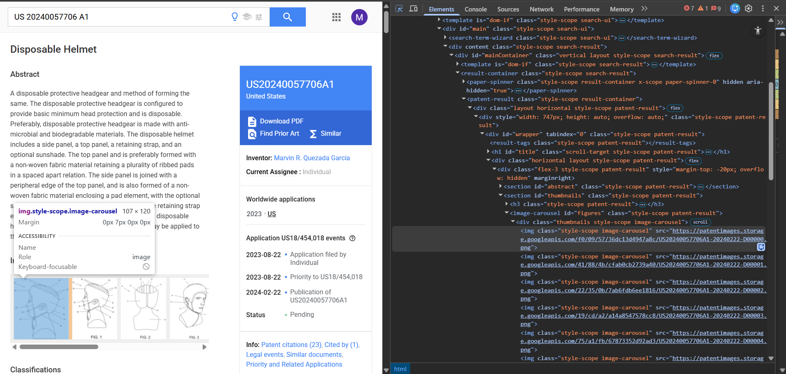
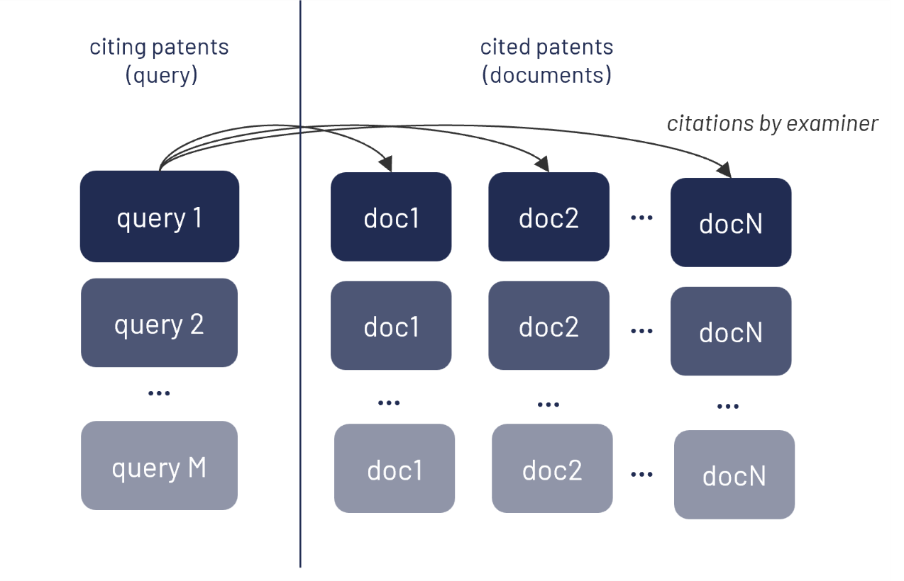

# Evaluation Dataset for Multimodal Information Retrieval - Google Patent Scraping

This repository provides scripts for constructing an evaluation dataset for multimodal information retrieval (IR). The pipeline enables the automatic creation of a custom dataset by scraping front-page images and first claims from Google Patents (https://patents.google.com/), as illustrated in Fig. 1.

**Fig. 1** - *Example of accessing the HTML element corresponding to the front-page image of a patent on Google Patents.*

We used existing patent citation metadata to establish query–document relationships: for each citing patent, its cited patents are retrieved and used as relevant documents. This approach allows the automatic generation of relevance labels, eliminating the need for costly and time-consuming manual annotation (see Fig. 2). This approach, applied jointly to patent images and textual content, is not currently supported by existing web service platforms such as Espacenet and the USPTO.

**Fig. 2** - *Automatic construction of query–document relevance labels using patent citation metadata.*

The query–document relationships derived from patent citation metadata are used as ground-truth relevance labels to evaluate retrieval performance. Specifically, these relationships enable the computation of standard information retrieval metrics, including *Precision@k*, *Recall@k*, and *F1-score@k*, by comparing the set of k documents retrieved by a model for a given query against the corresponding set of cited patents assumed to be relevant.

The resulting evaluation dataset was used in the following published work: *"Consoloni, M., Giordano, V., Galatolo, F. A., Cimino, M. G. C. A., & Fantoni, G. (2025). Uncovering the limits of visual-language models in engineering knowledge representation. Proceedings of the Design Society, 5, 3261-3270.* https://doi.org/10.1017/pds.2025.10340"

